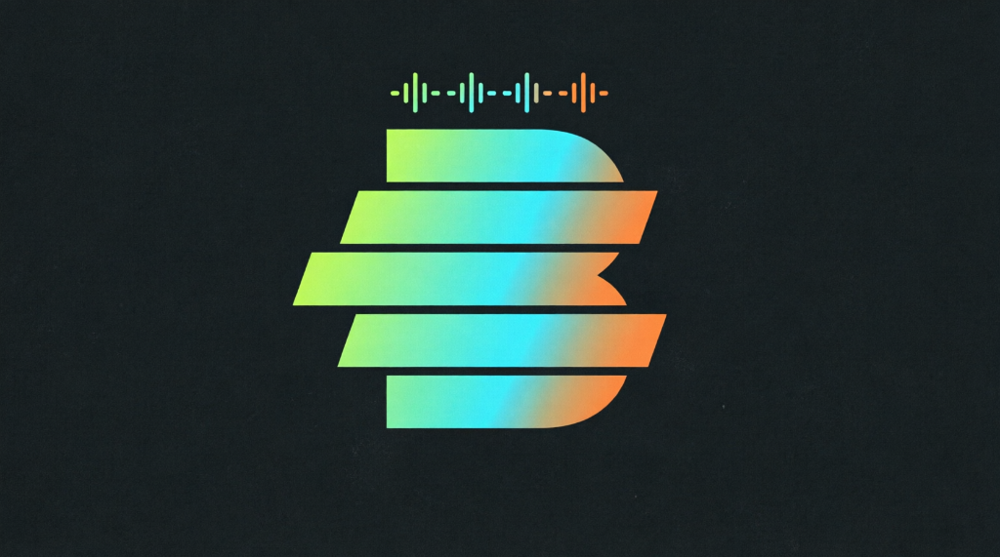
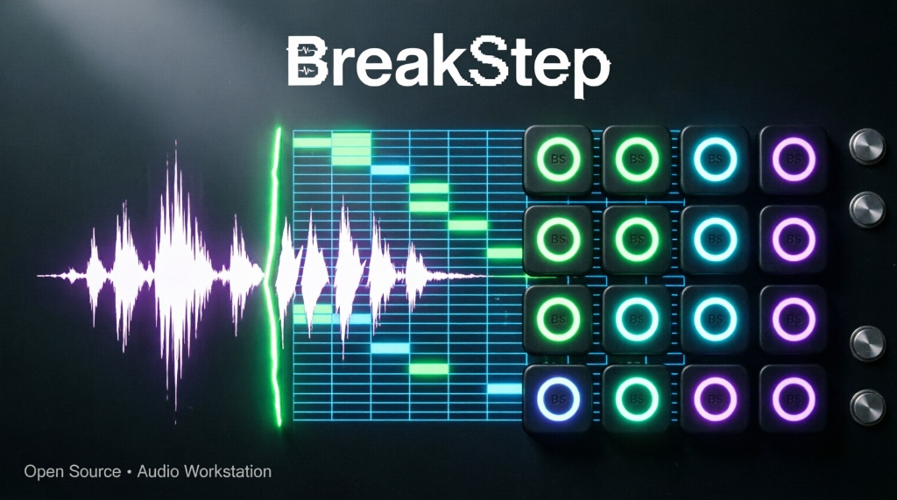
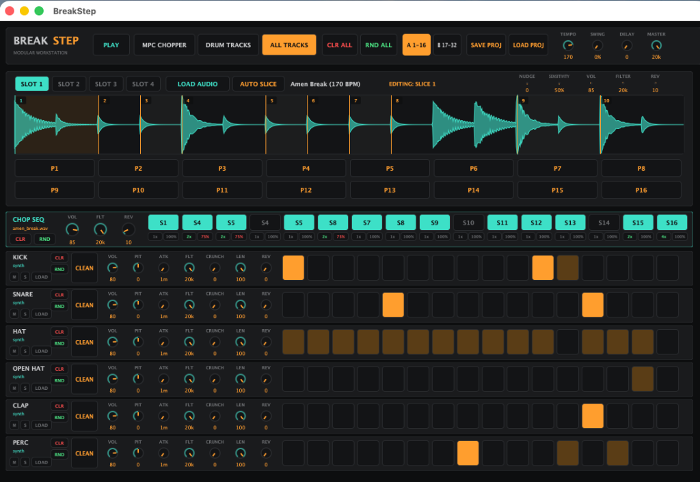
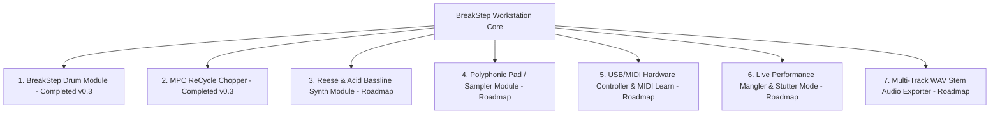
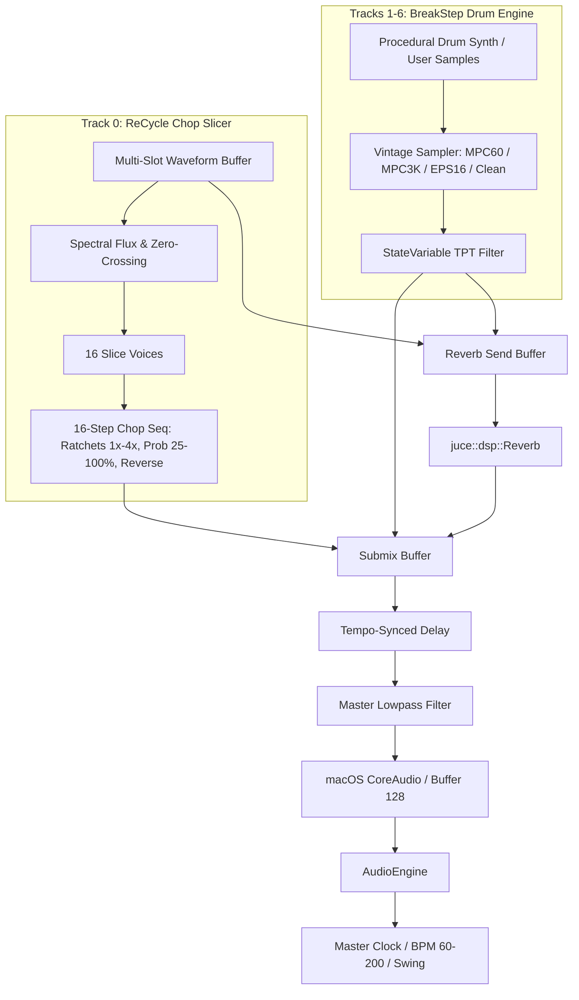

<p align="center">
  
</p>

<p align="center">
  
</p>

<h1 align="center">BreakStep: Modular Drum Machine & MPC-Style Transient Slicer</h1>

<p align="center">
  <a href="https://isocpp.org/"></a>
  <a href="https://juce.com/"></a>
  <a href="https://apple.com"></a>
  <a href="https://creativecommons.org/licenses/by-nc/4.0/"></a>
</p>

---

## Overview

**BreakStep** is a standalone, real-time audio workstation and step sequencer built in modern **C++17** and **JUCE 8**. It combines the raw, crunchy character of iconic 1990s hardware samplers (**Ensoniq EPS-16 Plus**, **Akai MPC-60**, and **Akai MPC-3000**) with an intelligent **Propellerhead ReCycle-style transient peak slicer** and an advanced **Drum & Bass step sequencer**.

> **Note**: This is the initial foundational release (**v0.3.0**). The architecture has been deliberately designed as an extensible **modular workstation host** that will continuously integrate additional synthesis engines, bassline modules, and performance tools.

<p align="center">
  
</p>

---

## Key Features (v0.3.0)

### 1. ReCycle-Style Waveform Lab & MPC Transient Chopper
- **Multi-Slot Sample Memory**: Load up to 4 audio loops/breakbeats (`.wav`, `.aiff`, `.mp3`, `.flac`) into Slots 1–4.
- **Adaptive Transient Peak Detection**:
  - High-frequency spectral pre-emphasis ($y[n] = x[n] - 0.92 x[n-1]$).
  - Dual envelope followers (fast attack $1.2\text{ms}$ vs. adaptive slow baseline $30\text{ms}$).
  - **Zero-Crossing Snapping** for click-free slice playback and reverse hits.
- **Interactive Slice Editing**:
  - Drag slice lines directly on the waveform to fine-tune transient points.
  - Dedicated **`NUDGE`** knob for sub-millisecond sample adjustments.
  - Double-click to insert new slice markers; right-click to delete.
  - **16 MPC Slice Pads**: Trigger and audition any slice instantaneously with millisecond length readouts.

### 2. 7-Track Unified Master Step Sequencer
- **Track 0 (`✂️ CHOP SEQ`)**:
  - Left-click to activate/deactivate steps.
  - Right-click / Ctrl-click to assign which slice (`S1` .. `S16`) plays on that step.
  - **Ratchets / Sub-steps**: Subdivide steps into $1\times, 2\times, 3\times, 4\times$ micro-rolls (1/32 and 1/64 DnB rolls).
  - **Probability (%)**: Set trigger chance from 25% to 100% for organic, evolving grooves.
  - Per-track **`CLR`** (Clear) and **`RND`** (Randomize) buttons.
- **Tracks 1–6 (BreakStep Drum Machine)**:
  - 6 dedicated channels: **Kick**, **Snare**, **Closed Hat**, **Open Hat**, **Clap**, and **Percussion**.
  - Built-in mathematical procedural synthesis with drag-and-drop external sample support.
  - **Vintage Sampler DSP Engines**:
    - **`CLEAN`**: 32-bit float Hi-Fi digital.
    - **`MPC-60`**: 12-bit / 40kHz DAC emulation + transformer soft saturation ($y = \tanh$).
    - **`MPC-3K`**: 16-bit warmth with asymmetric op-amp tape saturation ($y = 1.5x - 0.5x^3$).
    - **`EPS-16`**: Ensoniq OTIS variable-rate bit decimation and gritty aliasing crunch.
  - Dedicated **`CRUNCH`** knob per channel.
  - Individual Lowpass TPT Filters, Attack Envelopes, Pitch Tuning ($-12 \dots +12$), and Reverb Sends.

### 3. Master FX Rack & Transport
- **Master Feedback Delay**: 8th-note tempo-synced stereo delay.
- **Master Spatial Reverb**: Schroeder-Freeverb algorithm.
- **Master Continuous State-Variable (TPT) Filter**.
- **Global `[ CLR ALL ]` & `[ RND ALL ]`**: One-click pattern wipe or instant full-session breakbeat generation.
- **Native Project Persistence (`.breakstep`)**: Saves all BPM, swing, master FX, sample file paths, slice markers, and step matrices to clean JSON.

---

## Modular Expansion Roadmap

BreakStep is designed to evolve into a complete hardware-style modular workstation. The following modules and capabilities are scheduled on the development roadmap:



1. **Reese & 303 Acid Bassline Synth Module**: Dedicated monophonic synthesizer module with dual detuned saw waves, sub-oscillator, and resonant diode ladder filter for heavy Drum & Bass basslines.
2. **Polyphonic Sample & Pad Module**: Multi-voice melodic sampler supporting sustain loops, ADSR envelopes, and chord memory.
3. **USB / MIDI Hardware Controller & MIDI Learn**: Full MIDI mapping for external pad controllers (Akai MPK, Novation Launchpad, Arturia, Korg) and continuous CC knob mapping.
4. **Live Performance Mangler & Instant Stutter**: Momentary beat-repeat pads ($1/4, 1/8, 1/16, 1/32$), vinyl brake effect, and VCA master glue bus compressor.
5. **Multi-Track Stem Audio Exporter**: Offline rendering to 24-bit WAV/FLAC files (master mix and individual track stems) for live sets and DAW mixing.

---

## Architecture & Signal Flow



---

## Build Instructions (macOS)

### Prerequisites
- macOS 13.0+ (Tested on macOS 14 Sonoma and macOS 15 Sequoia).
- Xcode Command Line Tools (`xcode-select --install`).
- CMake 3.22+ (`brew install cmake`).

### Compiling and Running
```bash
# 1. Clone the repository
git clone https://github.com/Ultramal13/BreakStep.git
cd BreakStep/breakstep_juce

# 2. Configure CMake with JUCE 8 (FetchContent will automatically download JUCE)
cmake -B build -DCMAKE_BUILD_TYPE=Release -DCMAKE_OSX_DEPLOYMENT_TARGET=13.0

# 3. Build optimized native binary
cmake --build build --config Release -j8

# 4. Launch BreakStep
open build/BreakStep_artefacts/Release/BreakStep.app
```

---

## Repository Structure

```
BreakStep/
├── assets/
│   ├── breakstep_banner.png           # GitHub repository header banner
│   ├── breakstep_logo.png             # Official BreakStep logo mark
│   └── breakstep_ui_screenshot.png    # Live interface screenshot
├── breakstep_juce/
│   ├── CMakeLists.txt                 # CMake configuration for JUCE 8 & C++17
│   ├── TECHNICAL_DOCUMENTATION.md     # Comprehensive technical documentation & math formulas
│   ├── USER_GUIDE.md                  # User manual & workflow guide
│   ├── README.md                      # Project manual & build guide
│   └── Source/
│       ├── Main.cpp                   # Native desktop application entry point
│       ├── MainComponent.h / .cpp     # Master UI coordinator with scrollable Viewport
│       ├── Audio/
│       │   ├── AudioEngine.h / .cpp   # Real-time audio graph host & master mixer
│       │   ├── StepSequencer.h / .cpp # 32-step clock with swing, clear, and randomize
│       │   ├── DrumTrack.h / .cpp     # 6-channel drum voice engine
│       │   ├── VintageSamplerDSP.h    # MPC-60, MPC-3000, EPS-16+ bitcrush & saturation
│       │   └── SampleChopper/
│       │       ├── AudioSlicer.h / .cpp       # Multi-slot ReCycle transient slicer
│       │       └── SliceSequencer.h / .cpp    # DnB slice step sequencer
│       └── UI/
│           ├── CustomLookAndFeel.h / .cpp     # Dark hardware aesthetic & vector theme
│           ├── RotaryKnob.h / .cpp            # Custom rotary slider widget
│           ├── HeaderComponent.h / .cpp       # Master transport & global buttons
│           ├── TrackRowComponent.h / .cpp     # Drum track strip controls
│           ├── ChopTrackRowComponent.h / .cpp # Chop sequencer track strip
│           └── ChopperWaveformComponent.h / .cpp # Waveform display & 16 MPC pads
```

---

## License

This project is licensed under the **Creative Commons Attribution-NonCommercial 4.0 International (CC BY-NC 4.0)** License.

- **You are free to**: Share, copy, study, and adapt the code for non-commercial purposes.
- **Under the following terms**:
  - **Attribution**: You must give appropriate credit to **Cristian Huerta (@Ultramal13)**.
  - **NonCommercial**: You may **NOT** use the material or derivatives for commercial advantage or monetary compensation without prior written permission from the author.
