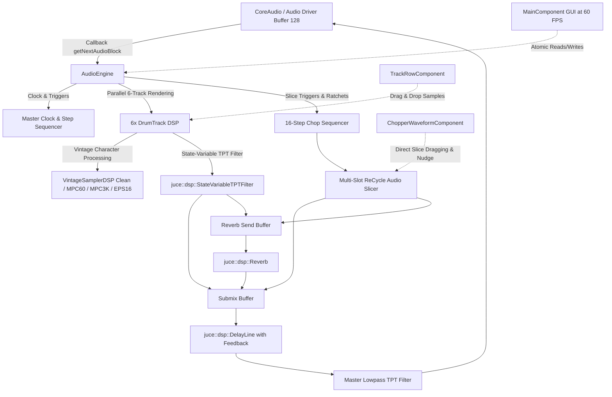
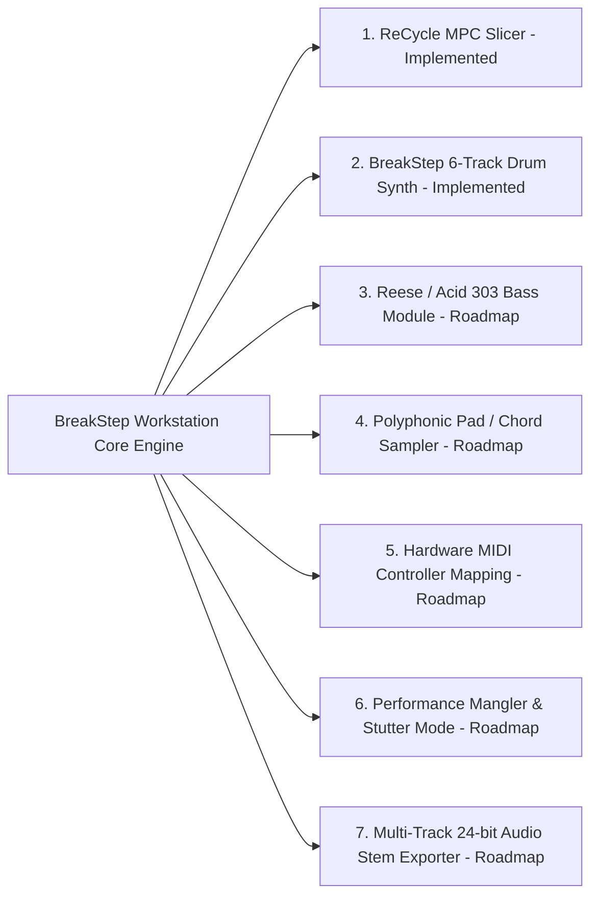

# BreakStep Technical Documentation & Architecture (C++17 & JUCE 8)

**BreakStep** is a standalone 32-phase step sequencer and modular audio workstation built in **C++17** utilizing the professional **JUCE 8** audio framework. It is inspired by the tactile workflow and raw sonic character of iconic 1990s hardware samplers (**Ensoniq EPS-16 Plus**, **Akai MPC-60** by Roger Linn, and **Akai MPC-3000**), integrated with a **Propellerhead ReCycle-style transient slicer** and an advanced **Drum & Bass step sequencer**.

---

## 1. Software Architecture & Threading Model

BreakStep follows a strict real-time audio architecture to ensure zero-latency performance and glitch-free stability:



- **Real-Time Audio Thread**: Executes the `getNextAudioBlock` callback via CoreAudio. Performs zero dynamic heap allocations (`malloc`/`new`), avoids mutex locks in the audio path, and processes buffers using SIMD-aligned vector instructions (Apple Silicon NEON / Intel AVX).
- **GUI Thread (60 FPS Timer)**: `MainComponent` executes a high-precision `juce::Timer` reading atomic variables (`std::atomic<int>`, `std::atomic<float>`) to render playhead indicators and meter states smoothly without blocking audio processing.

---

## 2. JUCE 8 Modules & Libraries Breakdown

The project leverages the core modules of **JUCE 8.0.4**:

### 2.1 `juce_audio_basics`
- **`juce::AudioBuffer<float>`**: Multi-channel audio buffers stored in contiguous memory for high-throughput SIMD digital signal processing.
- **`juce::MathConstants<double>`**: Mathematical constants ($\pi$, $2\pi$) for fractional interpolation and trigonometric oscillator phases.
- **`juce::jlimit` / `juce::roundToInt`**: High-performance numerical clamping and floating-point conversion.

### 2.2 `juce_audio_devices`
- **`juce::AudioDeviceManager`**: Native hardware interface for low-latency audio input/output, connecting directly to **CoreAudio** on macOS with buffer sizes down to 64/128 samples at 44.1kHz, 48kHz, and 96kHz.

### 2.3 `juce_audio_formats`
- **`juce::AudioFormatManager`**: Native multi-format decoder supporting:
  - **WAV** (16-bit, 24-bit, 32-bit float PCM).
  - **AIFF / AIFC** (Standard macOS audio interchange format).
  - **MP3** (Native system decoding).
  - **FLAC** and **Ogg Vorbis**.
- **`juce::AudioFormatReader`**: Direct stream reading and automatic sample rate resampling into channel memory.

### 2.4 `juce_dsp`
- **`juce::dsp::StateVariableTPTFilter<float>`**: Topology-Preserving Transform (TPT) filters. Unlike traditional biquad filters, TPT filters maintain continuous-time analog behavior with zero modulation artifacts when sweeping the cutoff frequency in real time.
- **`juce::dsp::DelayLine<float>`**: Circular memory delay buffer with fractional interpolation for tempo-synced 8th-note feedback delays.
- **`juce::dsp::Reverb`**: Stereo spatial reverberator based on the Schroeder-Freeverb physical model with room size, damping, and stereo width controls.
- **`juce::dsp::AudioBlock<float>`** & **`juce::dsp::ProcessContextReplacing<float>`**: High-performance DSP abstractions for in-place signal transformations.

### 2.5 `juce_gui_basics` & `juce_gui_extra`
- **`juce::AudioAppComponent`**: Unified desktop application base managing window lifecycle and audio stream initialization.
- **`juce::LookAndFeel_V4`**: Custom vector theme (`CustomLookAndFeel`) rendering dark hardware aesthetics, cyan LED arcs, and amber backlit buttons.
- **`juce::Viewport`**: Smooth vertical scrolling container ensuring all 7 tracks, knobs, and waveform pads are accessible on any screen size.
- **`juce::FileDragAndDropTarget`**: Instant drag-and-drop sample loading onto track strips and waveform screens.
- **`juce::FileChooser`**: Native file dialogs for loading audio samples and saving/loading `.breakstep` project sessions.
- **`juce::JSON` / `juce::var` / `juce::DynamicObject`**: Hierarchical serialization engine for project persistence.

---

## 3. Vintage Sampler Modeling DSP

In `Source/Audio/VintageSamplerDSP.h`, each channel features physical modeling of classic hardware converters and analog stages:

### 3.1 `CLEAN` Mode (32-bit Float Hi-Fi)
- Full 32-bit floating-point dynamic range (>140 dB SNR).
- Linear fractional interpolation without harmonic distortion or aliasing.

### 3.2 `MPC-60` Mode (Roger Linn 12-Bit / 40kHz DAC)
Emulates the punchy, upfront transient impact of the legendary 1988 Akai MPC-60:
1. **12-Bit Quantization**: Simulates the discrete R-2R ladder digital-to-analog converter ($2^{12} = 4096$ amplitude steps):
   $$\text{Quantize}(x, 12) = \frac{\text{round}(x \cdot 2^{11})}{2^{11}}$$
2. **40 kHz Sample Rate Decimation**: Emulates the MPC-60's fixed 40kHz clock, adding upper-mid presence without harsh digital distortion.
3. **Analog Output Stage / Transformer Soft Saturation**:
   $$y = 0.85 \cdot \tanh(1.25 \cdot x)$$

### 3.3 `MPC-3000` Mode (16-Bit Warm Discrete Preamp)
Models the warm, fat low-end and silky top-end of the Akai MPC-3000 (1994):
1. **16-Bit Linear Resolution**: Clean digital sampling without harsh bitcrushing.
2. **Asymmetric Tape / Op-Amp Saturation**:
   $$y = 1.5 \cdot x - 0.5 \cdot x^3 \quad (\text{for } |x| \le 1)$$

### 3.4 `EPS-16 Plus` Mode (Ensoniq OTIS Chip Crunch & Aliasing)
Recreates the gritty, raw character of the Ensoniq EPS-16 Plus sampler, essential to 1990s Drum & Bass breakbeats:
1. **Variable Dynamic Quantization (13-bit $\to$ 8-bit)**: Simulates the Ensoniq OTIS chip's floating-point bit reduction.
2. **Aggressive Sample-and-Hold Decimation (31.25 kHz $\to$ 11.2 kHz)**: Reproduces the absence of steep reconstruction filters, generating metallic aliasing harmonics when pitching breaks up or down.

### 3.5 ReCycle-Grade Transient Peak Slicer
The `AudioSlicer` engine implements an adaptive onset detection pipeline inspired by **Propellerhead ReCycle**:
1. **High-Frequency Spectral Pre-Emphasis**:
   $$y[n] = x[n] - 0.92 \cdot x[n-1]$$
   Isolates sharp percussive attacks (kick beater click, snare crack, hi-hat hits) from sustained reverberant tails.
2. **Dual-Time-Constant Envelope Followers**:
   - Fast attack follower ($\tau_{\text{attack}} \approx 1.2\text{ms}$) to capture precise transient peaks.
   - Adaptive baseline follower ($\tau_{\text{decay}} \approx 30\text{ms}$) scaling the relative threshold according to the `SENSITIVITY` knob.
3. **Zero-Crossing Snapping**:
   - Every detected or manually edited slice marker automatically snaps to the nearest sample where:
     $$x[n] \cdot x[n-1] \le 0 \quad \text{and} \quad |x[n]| \to 0$$
   - Prevents audio clicks, pops, and phase discontinuities during slice reordering or reverse playback.
4. **Interactive Slice Manipulation**:
   - Drag yellow slice markers directly with the mouse.
   - Fine-tune cut points sample-by-sample using the dedicated **`NUDGE`** knob.
   - Double-click to insert new slice markers; right-click to delete.
   - Trigger any of the **16 MPC Slice Pads** for instantaneous auditioning with millisecond length readouts.

---

## 4. Procedural Drum Synthesis Formulas

When no external audio samples are loaded, BreakStep mathematically generates its own drum sounds in memory:

| Track | Synthesis Algorithm | Mathematical Formula / Parameters |
|---|---|---|
| **KICK** | Exponential Sine Frequency Sweep (Chirp) | $f(t) = 45 + 105 \cdot e^{-35t}$, Envelope: $e^{-12t}$ |
| **SNARE** | White Noise Burst + $190\text{Hz}$ Triangular Tone | $\text{Noise} \cdot e^{-22t} \cdot 0.7 + \sin(2\pi \cdot 190 \cdot t) \cdot e^{-35t} \cdot 0.5$ |
| **HAT** | Highpass Filtered White Noise ($9\text{kHz}$) | $\text{Noise} \cdot e^{-70t} \cdot 0.5$ ($50\text{ms}$ ultra-short) |
| **OPEN HAT** | Sustained Highpass Filtered White Noise ($9\text{kHz}$) | $\text{Noise} \cdot e^{-12t} \cdot 0.5$ ($350\text{ms}$ decay) |
| **CLAP** | Triple Noise Pulse Burst + $1.2\text{kHz}$ Bandpass | 3 consecutive attacks ($10\text{ms}$, $20\text{ms}$, $30\text{ms}$) with $25\text{ms}^{-1}$ decay |
| **PERC** | Resonant Square Wave Sweep ($420\text{Hz} \to 180\text{Hz}$) | $\text{Square}(f(t)) \cdot e^{-28t}$ |

---

## 5. Native Project Session Schema (`.breakstep`)

The `.breakstep` project format is a structured JSON document persisting the full workstation state:
- **Global**: `bpm`, `swing`, `delayWet`, `masterCutoff`.
- **Slicer**: `loadedFilePath`, `activeSlot`, `volume`, `cutoff`, `reverbSend`, and `sliceSequence` array (`sliceIndex`, `ratchets`, `probability`, `reverse`, `pitchOffset`).
- **Tracks (Tracks 0 to 5)**:
  - `name`, `sampleName`, `samplePath` (Absolute filesystem path for automatic sample reloading).
  - `volume`, `pitch`, `attack`, `cutoff`, `length`, `reverbSend`.
  - `vintageMode` (0 = Clean, 1 = MPC-60, 2 = MPC-3000, 3 = EPS-16+).
  - `crunch` (0.0 to 1.0).
  - `mute`, `solo`.
  - `steps`: Array of 32 integer states ($0 = \text{Off}, 1 = \text{Normal}, 2 = \text{Accent}$).

---

## 6. Modular Expansion Architecture & Development Roadmap

BreakStep is designed with an open modular interface allowing continuous integration of new synthesizer, sampler, and FX modules:



1. **Reese & 303 Acid Bassline Synthesizer**: Monophonic dual-oscillator subtractive module with phase-inverted detuned saws, sub-sine bass, and non-linear diode ladder filter.
2. **Polyphonic Sample & Pad Module**: Multi-voice melodic playback with loop points, multi-stage ADSR envelopes, and chord generation.
3. **Hardware USB/MIDI Controller Integration**: Plug-and-play mapping for external pad controllers (Akai MPK, Launchpad, Arturia, Korg) and bidirectional MIDI Clock In/Out.
4. **Live Performance Mangler & Stutter Matrix**: Real-time momentary beat repeats ($1/4, 1/8, 1/16, 1/32$), vinyl tape stop emulation, and master bus glue compression.
5. **Multi-Track Stem Exporter**: Offline rendering to 24-bit WAV/FLAC files (individual channel stems + master mix) for live sets and DAW mixing.

---

## 7. Build Guide (macOS)

### Terminal Compilation:
```bash
# 1. Navigate to the JUCE project directory
cd breakstep_juce

# 2. Configure CMake with JUCE 8
cmake -B build -DCMAKE_BUILD_TYPE=Release -DCMAKE_OSX_DEPLOYMENT_TARGET=13.0

# 3. Build optimized native binary (-j8 uses all CPU cores)
cmake --build build --config Release -j8

# 4. Launch BreakStep
open build/BreakStep_artefacts/Release/BreakStep.app
```
