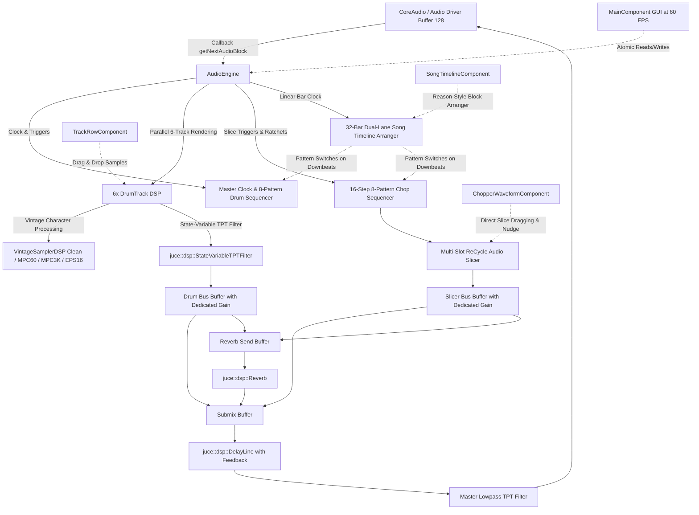

# BreakStep Technical Documentation & Architecture (C++17 & JUCE 8)

**BreakStep** is a standalone 32-phase step sequencer and modular audio workstation built in **C++17** utilizing the professional **JUCE 8** audio framework. It is inspired by the tactile workflow and raw sonic character of iconic 1990s hardware samplers (**Ensoniq EPS-16 Plus**, **Akai MPC-60** by Roger Linn, and **Akai MPC-3000**), integrated with a **Propellerhead ReCycle-style transient slicer**, an advanced **Drum & Bass step sequencer**, and a **Propellerhead Reason-style linear song timeline arranger**.

---

## 1. Software Architecture & Threading Model

BreakStep follows a strict real-time audio architecture to ensure zero-latency performance and glitch-free stability:



- **Real-Time Audio Thread**: Executes the `getNextAudioBlock` callback via CoreAudio. Performs zero dynamic heap allocations (`malloc`/`new`), avoids mutex locks in the audio path, and processes buffers using SIMD-aligned vector instructions (Apple Silicon NEON / Intel AVX).
- **GUI Thread (60 FPS Timer)**: `MainComponent` executes a high-precision `juce::Timer` reading atomic variables (`std::atomic<int>`, `std::atomic<float>`) to render playhead indicators, bar progress, and meter states smoothly without blocking audio processing.

---

## 2. Independent Submix Bus Volume Architecture

BreakStep provides dedicated submix buses before the master FX chain:
1. **`DRUMS` Bus**: Sums all 6 drum voices (`Kick`, `Snare`, `Hat`, `Open Hat`, `Clap`, `Perc`) and scales the buffer using atomic `drumBusVolume` ($0.0 \dots 1.0$).
2. **`CHOP / SAMPLER` Bus**: Renders the multi-slot sliced loop playback and scales the buffer using atomic `samplerBusVolume` ($0.0 \dots 1.0$).
3. **Master Submix Summation**: Both buses are summed into `submixBuffer` and routed into the master feedback delay, spatial reverb, and continuous state-variable lowpass filter.

---

## 3. Multi-Pattern Memory Banks (`P1` .. `P8`)

Both engines feature 8 independent pattern memory slots:
- **Drum Machine Patterns (`D1` .. `D8`)**: Stores 32-step matrices ($0=\text{Off}, 1=\text{Normal}, 2=\text{Accent}$) across all 6 tracks.
- **Slice Chopper Patterns (`S1` .. `S8`)**: Stores 16 slice steps (active, slice index $0..15$, ratchets $1\times..4\times$, probability $25\%..100\%$, reverse playback, pitch offset).
- **Instant Pattern Switching**: Seamlessly recall or edit any pattern on the fly via the `P1..P8` buttons in the header bar.

---

## 4. Propellerhead Reason-Style Linear Song Timeline Arranger

The `SongTimeline` module provides full song composition capabilities:
- **32-Bar Matrix**: Visual grid representing 32 measures of 4/4 meter.
- **Lane 1 (DRUM BLOCKS)**: Assigns which drum pattern (`D1` to `D8`) or mute state (`---`) plays on each bar.
- **Lane 2 (CHOPS BLOCKS)**: Assigns which slice pattern (`S1` to `S8`) or mute state (`---`) plays on each bar.
- **Mode Switch**:
  - **`PATTERN MODE`**: Loops the currently selected pattern indefinitely for live beatmaking.
  - **`SONG MODE`**: Plays through the multi-bar timeline, automatically switching drum and chop patterns on every downbeat.
- **Live Playhead Indicator**: Smooth graphical playhead tracking bar and beat progress at 60 FPS.

---

## 5. Genre Style Templates Engine

The `StyleTemplates` module delivers 1-click loading of authentic electronic music genres:

| Preset | BPM | Swing | Vintage DSP Mode | Rhythm & Arranger Description |
|---|---|---|---|---|
| **DnB Roller** | 174 | 0% | MPC-60 (12-bit / 40kHz) | Classic 2-step rolling groove with ghost snare syncopations and stepped kick variations across 8 patterns. |
| **Jungle Amen** | 168 | 8% | EPS-16+ (Variable Crunch) | Fast chopped Amen Break variations with $2\times/4\times$ ratchets, reverse slices, and pitched kicks. |
| **Dubstep 140** | 140 | 0% | MPC-60 Punch | Heavy half-time kick-snare (kick on 1, snare on 3), sparse metallic hats, and percussive chop stabs. |
| **UK Garage 2-Step** | 132 | 58% | MPC-3000 Tape Warmth | Signature 2-step shuffle, skipped kicks, swung offbeat hats, and syncopated claps. |
| **UK Bass / Bassline** | 138 | 25% | EPS-16+ Crunch | Driving 4x4 and syncopated kicks, aggressive crunch saturation, and rolling chop fills. |
| **Nu-Skool Breaks** | 135 | 18% | Clean Hi-Fi | Chunky syncopated acoustic break chops with open hats on offbeats and dynamic fills. |
| **Liquid DnB** | 172 | 10% | MPC-3000 Warmth | Smooth rolling drums, subtle shuffle, 8th-note feedback delay ($25\%$), and atmospheric chop loops. |

---

## 6. Build Guide (macOS)

### Terminal Compilation:
```bash
# 1. Navigate to the JUCE project directory
cd breakstep_juce

# 2. Configure CMake with JUCE 8
cmake -B build -DCMAKE_BUILD_TYPE=Release -DCMAKE_OSX_DEPLOYMENT_TARGET=13.0

# 3. Build optimized native binary (-j8 uses all CPU cores)
cmake --build build --config Release -j8

# 4. Launch BreakStep
open build/BreakStep_artefacts/Release/BreakStep.app
```
