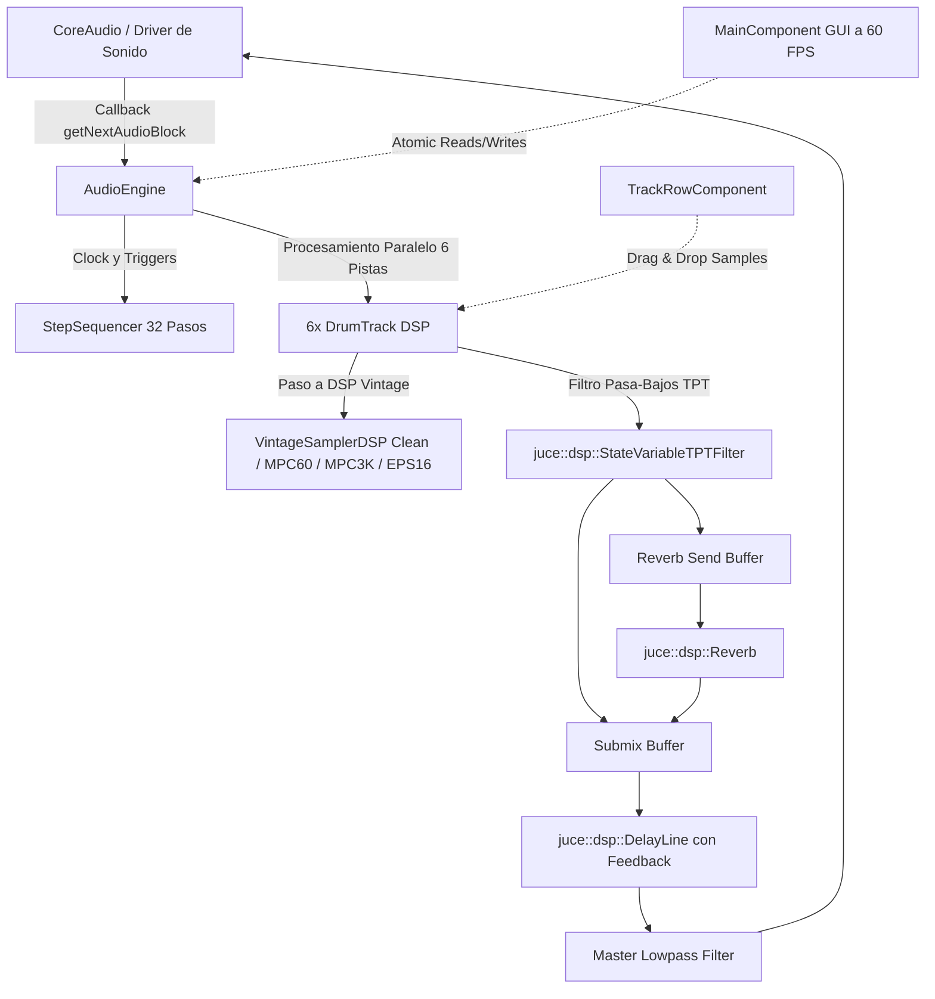

# Documentación Técnica y Arquitectura de BreakStep C++ & JUCE

**BreakStep** es un instrumento musical y secuenciador por pasos de 32 fases diseñado en **C++17** sobre el framework de audio profesional **JUCE 8**, inspirado en la respuesta táctil y el carácter sonoro de los samplers de culto de los años 90 (como el **Ensoniq EPS-16 Plus**, la **Akai MPC-60** de Roger Linn y la **Akai MPC-3000**).

---

## 1. Arquitectura de Software y Modelo de Hilos

BreakStep sigue una arquitectura de audio en tiempo real estricta para garantizar latencia ultra-baja y estabilidad absoluta:



- **Thread de Audio en Tiempo Real (Real-Time Audio Thread)**: Ejecuta el callback `getNextAudioBlock` de CoreAudio. No realiza asignaciones dinámicas de memoria (`malloc`/`new`), no bloquea mutexes y procesa el audio en buffers vectorizados SIMD.
- **Thread de Interfaz Gráfica (GUI Thread a 60 FPS)**: `MainComponent` ejecuta un `juce::Timer` que lee de forma atómica (`std::atomic<int>`) la posición del cursor de reproducción y actualiza la interfaz visualmente sin interferir con el motor sonoro.

---

## 2. Librerías y Módulos de JUCE Utilizados

El proyecto utiliza los módulos oficiales de **JUCE 8** compilados con AppleClang / Clang:

### 2.1 `juce_audio_basics`
- **`juce::AudioBuffer<float>`**: Gestión de buffers de audio multicanal en memoria contigua alineada para instrucciones vectoriales SIMD (NEON en Apple Silicon / AVX en Intel).
- **`juce::MathConstants<double>`**: Constantes matemáticas para transformadas trigonométricas y generadores de fase ($\pi$, $2\pi$).
- **`juce::jlimit` / `juce::roundToInt`**: Algoritmos de truncado numérico rápido y conversión de punto flotante a enteros.

### 2.2 `juce_audio_devices`
- **`juce::AudioDeviceManager`**: Gestión nativa de hardware de entrada y salida de audio. En macOS se conecta directamente a **CoreAudio** logrando latencias de buffer de 64, 128 o 256 muestras a 44.1kHz / 48kHz / 96kHz.

### 2.3 `juce_audio_formats`
- **`juce::AudioFormatManager`**: Decodificador multiformato integrado para cargar y reproducir archivos de audio de forma nativa sin librerías externas:
  - **WAV** (PCM de 16, 24 y 32 bits float).
  - **AIFF / AIFC** (Formato clásico de producción en Mac).
  - **MP3** (Decodificación nativa del sistema).
  - **FLAC** y **Ogg Vorbis**.
- **`juce::AudioFormatReader`**: Lectura y extracción directa de muestras hacia los buffers de canal con conversión automática de frecuencia de muestreo.

### 2.4 `juce_dsp`
- **`juce::dsp::StateVariableTPTFilter<float>`**: Filtros State-Variable con **Topología Preservada en Tiempo Continuo (TPT)**. A diferencia de los filtros biquad clásicos, no presentan artefactos al modular el corte de frecuencia en tiempo real y mantienen una respuesta analógica perfecta.
- **`juce::dsp::DelayLine<float>`**: Línea de retraso circular en memoria con interpolación de retraso fraccional para el efecto de Feedback Delay master sincronizado a semicorcheas o corcheas.
- **`juce::dsp::Reverb`**: Algoritmo de reverberación espacial basado en el modelo Schroeder-Freeverb con control de tamaño de sala (room size), amortiguación de agudos (damping) y dispersión estéreo (width).
- **`juce::dsp::AudioBlock<float>`** y **`juce::dsp::ProcessContextReplacing<float>`**: Abstracción de procesamiento DSP de alto rendimiento para aplicar transformaciones de señal in-place.

### 2.5 `juce_gui_basics` y `juce_gui_extra`
- **`juce::AudioAppComponent`**: Clase base de aplicación que unifica la ventana gráfica y el ciclo de vida del audio.
- **`juce::LookAndFeel_V4`**: Motor de tematización gráfica personalizado (`CustomLookAndFeel`) para el renderizado vectorial de perillas giratorias oscuras, arcos cian y botones con retroiluminación LED ámbar.
- **`juce::FileDragAndDropTarget`**: Protocolo que permite arrastrar cualquier archivo de audio desde Finder y soltarlo directamente sobre la fila de una pista.
- **`juce::FileChooser`**: Selectores de archivo nativos de macOS para abrir muestras y guardar/cargar archivos de proyecto `.breakstep`.
- **`juce::JSON` / `juce::var` / `juce::DynamicObject`**: Motor de serialización jerárquico para guardar el estado completo del secuenciador.

---

## 3. Modelado de Samplers Vintage (EPS-16+, MPC-60, MPC-3000)

En `Source/Audio/VintageSamplerDSP.h`, cada pista cuenta con un motor de modelado físico de convertidores y preamplificadores vintage:

### 3.1 Modo `CLEAN` (Hi-Fi Digital 32-bit Float)
- Rango dinámico completo de 32 bits en coma flotante (>140 dB SNR).
- Interpolación lineal pura sin distorsión armónica ni aliasing.

### 3.2 Modo `MPC-60` (Roger Linn 12-Bit / 40kHz)
Diseñado para recrear el sonido contundente y con pegada (punch) de la legendaria MPC de 1988:
1. **Cuantización de 12 Bits**: Emula la escalera del conversor digital-analógico (DAC) con $2^{12} = 4096$ niveles discretos de amplitud:
   $$\text{Quantize}(x, 12) = \frac{\text{round}(x \cdot 2^{11})}{2^{11}}$$
2. **Diezmado de Tasa de Muestreo a 40 kHz**: El DAC de la MPC-60 trabajaba a 40kHz nominales, lo que añade presencia en los medios-altos sin llegar a sonar excesivamente degradado.
3. **Etapa de Salida Analógica / Saturación de Transformador**: Emulación de saturación suave mediante tangente hiperbólica:
   $$y = 0.85 \cdot \tanh(1.25 \cdot x)$$

### 3.3 Modo `MPC-3000` (16-Bit Warm Discrete Preamp)
Modela el sonido cálido, grueso y con graves definidos de la MPC-3000 (1994):
1. **Resolución de 16 Bits**: Claridad sin asperezas digitales.
2. **Saturación Armónica Asimétrica**: Curva de saturación tipo cinta / transistor discreto:
   $$y = 1.5 \cdot x - 0.5 \cdot x^3 \quad (\text{para } |x| \le 1)$$

### 3.4 Modo `EPS-16 Plus` (Ensoniq OTIS Chip Crunch & Aliasing)
El sonido característico de los samplers Ensoniq de principios de los 90s, clave en la historia del Drum & Bass:
1. **Cuantización Variable (13-bit $\to$ 8-bit)**: El chip OTIS de Ensoniq operaba con punto flotante simulado y grano digital áspero.
2. **Diezmado Sample-and-Hold Agresivo (31.25 kHz $\to$ 11.2 kHz)**: Reproduce la falta de filtros de reconstrucción anti-aliasing pesados, generando los armónicos ásperos y metálicos característicos al acelerar breakbeats.

### 3.5 Motor de Corte de Picos de Transientes (Tipo ReCycle / Propellerhead)
El motor de troceado (`AudioSlicer`) implementa una cadena de detección adaptativa inspirada en **Propellerhead ReCycle**:
1. **Pre-énfasis Espectral de Altas Frecuencias**:
   $$y[n] = x[n] - 0.92 \cdot x[n-1]$$
   Resalta los ataques percusivos rápidos (el *snap* de la caja, el *beater* del bombo y el golpe del hi-hat) diferenciándolos del cuerpo tonal o reverberación sostenida.
2. **Seguidores de Envolvente Dual**:
   - Ataque ultra-rápido ($\tau_{\text{attack}} \approx 1.2\text{ms}$) para capturar el instante exacto del transiente.
   - Piso base adaptativo ($\tau_{\text{decay}} \approx 30\text{ms}$) para evitar falsos disparos en la cola de los sonidos.
3. **Alineación a Cruce por Cero (*Zero-Crossing Snapping*)**:
   - Cada punto de corte detectado o editado manualmente se desplaza automáticamente hacia la muestra más cercana donde:
     $$x[n] \cdot x[n-1] \le 0 \quad \text{y} \quad |x[n]| \to 0$$
   - Esto previene completamente *clicks*, *pops* o chasquidos al reproducir los slices fuera de orden o en reversa.

### 3.6 Arquitectura de la Workstation Unificada de 7 Pistas
La pantalla principal integra todo el flujo en una única vista organizada:
1. **Laboratorio Superior de Waveform & MPC Chopper**:
   - **4 Slots de Carga (`SLOT 1` a `SLOT 4`)**: Permite tener cargados hasta 4 breakbeats, frases melódicas o pads en memoria y alternar entre ellos.
   - **Perilla `NUDGE`**: Desplaza la línea de corte del slice seleccionado milimétricamente hacia adelante o hacia atrás con ajuste magnético al cruce por cero (*Zero-Crossing*).
   - **Perilla `SENSITIVITY`** y botón **`AUTO SLICE`**: Detecta y redibuja los ataques de bombo y caja automáticamente.
   - **16 Pads MPC**: Disparo y audición inmediata de cada chop con milisegundos de duración en pantalla.
2. **Secuenciador Maestro Unificado (Pistas 0 a 6)**:
   - **Pista 0 (`✂️ CHOP SEQ`)**: Secuenciador de 16 pasos dedicado a los cortes del breakbeat.
     - Click izquierdo: Activa/desactiva el paso.
     - Click derecho o Ctrl+Click: Asigna qué corte (`S1` a `S16`) suena en ese paso.
     - Botón `1x/2x/3x/4x`: Activa *ratchets* (redobles ultrarrápidos para Drum & Bass).
     - Botón `100%/75%/50%/25%`: Probabilidad de disparo.
     - Botones `CLR` y `RND`: Borrado y generación aleatoria del patrón de cortes.
   - **Pistas 1 a 6 (`KICK`, `SNARE`, `HAT`, `OPEN HAT`, `CLAP`, `PERC`)**:
     - Las 6 pistas de batería con botones vintage (**`CLEAN`**, **`MPC-60`**, **`MPC-3K`**, **`EPS-16`**) y perilla de **`CRUNCH`**.
     - Botones `CLR` y `RND` por cada canal para crear ritmos independientes.
     - Todos los canales y el Chop Track tocan en sincronía matemática sample-accurate sobre el mismo reloj maestro.

---

## 4. Síntesis Procedural de Percusión Integrada

Cuando no se carga ningún sample externo, BreakStep genera matemáticamente sus propios sonidos de batería en memoria a la frecuencia de muestreo nativa:

| Pista | Algoritmo de Generación | Fórmula / Parámetros |
|---|---|---|
| **KICK** | Barrido de frecuencia sinusoidal exponencial (Chirp) | $f(t) = 45 + 105 \cdot e^{-35t}$, Env: $e^{-12t}$ |
| **SNARE** | Ruido blanco con caída + Tono triangular de $190\text{Hz}$ | $\text{Noise} \cdot e^{-22t} \cdot 0.7 + \sin(2\pi \cdot 190 \cdot t) \cdot e^{-35t} \cdot 0.5$ |
| **HAT** | Ruido blanco pasa-altos $9\text{kHz}$ ultracorto | $\text{Noise} \cdot e^{-70t} \cdot 0.5$ ($50\text{ms}$) |
| **OPEN HAT** | Ruido blanco pasa-altos $9\text{kHz}$ sostenido | $\text{Noise} \cdot e^{-12t} \cdot 0.5$ ($350\text{ms}$) |
| **CLAP** | Ráfaga de 3 impulsos de ruido + Filtro pasa-banda $1.2\text{kHz}$ | 3 ataques sucesivos ($10\text{ms}$, $20\text{ms}$, $30\text{ms}$) con caída de $25\text{ms}^{-1}$ |
| **PERC** | Barrido de onda cuadrada de $420\text{Hz} \to 180\text{Hz}$ | $\text{Square}(f(t)) \cdot e^{-28t}$ |

---

## 5. Formato de Archivo Nativo `.breakstep`

El archivo de proyecto `.breakstep` es un documento JSON estructurado que persiste:
- **Global**: `bpm`, `swing`, `delayWet`, `masterCutoff`.
- **Slicer**: `loadedFilePath`, `activeSlot`, `volume`, `cutoff`, `reverbSend`, y array de pasos de `sliceSequence` (sliceIndex, ratchets, probability, reverse, pitchOffset).
- **Pistas (Tracks 0 a 5)**:
  - `name`, `sampleName`, `samplePath` (Ruta absoluta en el disco para recarga automática).
  - `volume`, `pitch`, `attack`, `cutoff`, `length`, `reverbSend`.
  - `vintageMode` (0 = Clean, 1 = MPC-60, 2 = MPC-3000, 3 = EPS-16+).
  - `crunch` (0.0 a 1.0).
  - `mute`, `solo`.
  - `steps`: Array de 32 enteros ($0 = \text{Off}, 1 = \text{Normal}, 2 = \text{Acento}$).

---

## 6. Guía de Compilación

### Compilación desde Terminal (macOS):
```bash
# 1. Entrar al directorio del proyecto JUCE
cd breakstep_juce

# 2. Configurar CMake con JUCE 8
cmake -B build -DCMAKE_BUILD_TYPE=Release -DCMAKE_OSX_DEPLOYMENT_TARGET=13.0

# 3. Compilar binario nativo optimizado (-j8 para todos los núcleos)
cmake --build build --config Release -j8

# 4. Ejecutar la aplicación
open build/BreakStep_artefacts/Release/BreakStep.app
```
